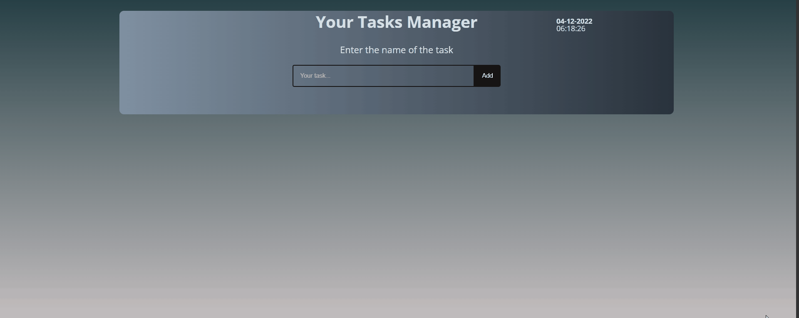

# TasksManager

## Overview 🔍



The aim of the project was to create a task management application. Communication is via local api (JSON Server). The structure and funcionality in this project i made focusing on Class components.

### Features:

- **Adding tasks**
- **Task management:**
    - **start the countdown**
    - **stop the countdown**  
    - **end a task** 
    - **delate a task**


## Built with 🔧


## Installation and configuration 💾

The project uses [node](https://nodejs.org/en/) and [npm](https://www.npmjs.com/), follow the steps below to be able to use the application.

- Install all npm packages using command:
````
npm i
````

- To start develope mode use command:

````
npm start
````
- If you don't have JSON server installed on your device use command:
````
npm install json-server -g
````

- To run JSON server use command:
````
json-server --watch ./db/data.json --port 3005
````

- From now on, the application is available at:

````
http://localhost:8080
````

* Databse is available at:
````
http://localhost:3005/data
````

## Author 🔥
* Linkedin - [AndrejKaczanowski](https://www.linkedin.com/in/andrej-kaczanowski-frontend/).

## Special thanks 🙏🏻
Thanks to my [Mentor - devmentor.pl](https://devmentor.pl/) - for providing me with this task and for code review.
